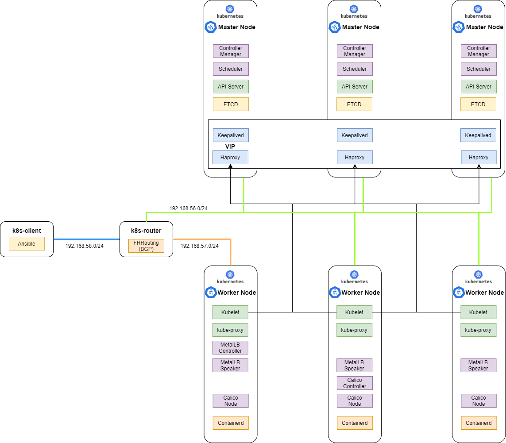

# Kubernetes Onprem Labs

이 가이드는 온프렘에서 K8S 테스트 환경을 구현하기 위한 방법을 다룹니다.
HA 구성 및 부하분산을 고려하여 Keepalived, HAproxy가 설치되며, ETCD는 베어메탈에 바로 구성되는 방식으로 설정됩니다.
또한 CA는 사설 인증서를 생성하여 적용하도록 구성되어 있습니.

## Architecture

## Differences from kubernetes-the-hard-way by Kelsey Hightower 

* CNI는 Calico를 사용하였습니다.
* On-premise의 환경에서 사용하는 LoadBalancer는 MetalLB로 구성하였습니다.
* Kube-apiserver의 Endpoint 단일화를 위해 Master node에 Keepalived/Haproxy를 구성하였습니다.

## Cluster Details

* [kubernetes](https://github.com/kubernetes/kubernetes) v1.21.7
* [containerd](https://github.com/containerd/containerd) v1.4.12
* [etcd](https://github.com/coreos/etcd) v3.4.15
* [calico](https://github.com/projectcalico/calico) v3.21.1
* [MetalLB](https://metallb.universe.tf) v0.10.2
* [FRRouting](https://frrouting.org/) v7.5.1

## Labs

테스트 환경은 On-premise와 비슷하게 테스트하기 위해 가상머신에서 테스트를 진행하며, 가상머신은 Virtualbox를 사용하였습니다.

* [Prerequisites](docs/01-prerequisites.md)
* [Provisioning Compute Resources](docs/02-compute-resources.md)
* [Installing the Client Tools](docs/03-client-tools.md)
* [Provisioning the CA and Generating TLS Certificates](docs/04-certificate-authority.md)
* [Bootstrapping the etcd Cluster](docs/05-bootstrapping-etcd.md)
* [Bootstrapping Container Runtime](docs/06-bootstrapping-container-runtime.md)
* [Bootstrapping the Kubernetes Control Plane](docs/07-bootstrapping-kubernetes-control-plane.md)
* [Bootstrapping the Kubernetes Worker Nodes](docs/08-bootstrapping-kubernetes-workers.md)
* [Provisioning Pod Network CNI Calico](docs/09-provisioning-pod-network-cni-calico.md)
* [Provisioning Loadbalancer Network MetalLB](docs/10-provisioning-lb-network-metallb.md)

## 참고 사이트
* [Kubernetes The Hard Way](https://github.com/kelseyhightower/kubernetes-the-hard-way)
